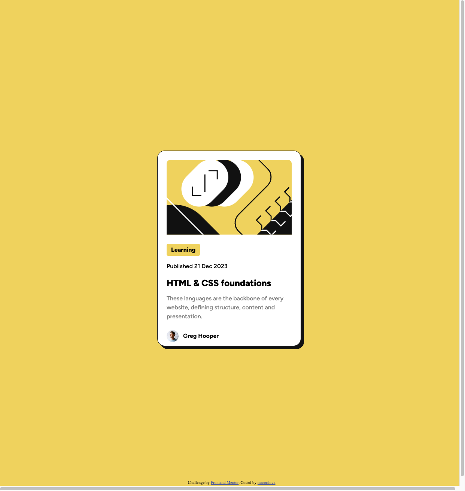

# Frontend Mentor - Blog preview card solution

This is a solution to the [Blog preview card challenge on Frontend Mentor](https://www.frontendmentor.io/challenges/blog-preview-card-ckPaj01IcS). Frontend Mentor challenges help you improve your coding skills by building realistic projects.

## Table of contents

- [Overview](#overview)
  - [The challenge](#the-challenge)
  - [Screenshot](#screenshot)
  - [Links](#links)
- [My process](#my-process)
  - [Built with](#built-with)
  - [What I learned](#what-i-learned)
  - [Continued development](#continued-development)
  - [Useful resources](#useful-resources)
- [Author](#author)

## Overview

### The challenge

Users should be able to:

- See hover and focus states for all interactive elements on the page

### Screenshot

### Links

- Solution URL: [Github repo](https://github.com/mrcordova/blog-preview-card)
- Live Site URL: [blog-preview-card](https://mrcordova.github.io/blog-preview-card/)

## My process

### Built with

- Semantic HTML5 markup
- CSS custom properties
- Flexbox

### What I learned

I learned how to use flex to move items around and center card relative to the body.

### Continued development

I will work on how to make more responsice layouts.

### Useful resources

- [Move Footer to bottom of site](https://stackoverflow.com/questions/1488565/how-to-stick-a-footer-to-bottom-in-css) - Reminder on how to move a footer to the bottom of screen.

## Author

- Website - [mrcordova's github](https://www.your-site.com)
- Frontend Mentor - [@mrcordova](https://www.frontendmentor.io/profile/yourusername)
